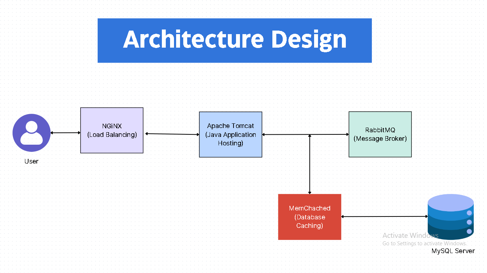

# Deploying Multi-Tier Web Application using Infrastructure as Code (IaC)

## Overview

This project aims to facilitate the deployment of a multi-tier java based web application using Infrastructure as Code (IaC). The IaC tools used include Vagrant for virtual machine management, VMware Hypervisor for virtualization, Bash for scripting, and Gitbash for command line interface.

## Architecture Design



## Prerequisites

Before proceeding with the deployment, make sure you have the following tools installed:

1. **Vagrant:** Download and install Vagrant from [https://www.vagrantup.com/](https://www.vagrantup.com/).

2. **VMware Hypervisor:** Install VMware Hypervisor to manage virtual machines. You can download it from [https://www.vmware.com/products/workstation-player.html](https://www.vmware.com/products/workstation-player.html).

3. **Bash:** Ensure that Bash is available on your system. Most Unix-based systems come with Bash pre-installed.

4. **Git:** Install Git from [https://git-scm.com/](https://git-scm.com/).

## Steps to Deploy

### 1. Clone Source Code

Clone the source code repository to your local machine using Git:

```bash
git clone <repository_url>
```

### 2. Navigate to Vagrant Directory

Change your current working directory to the Vagrant directory:

```bash
cd <path_to_vagrant_directory>
```

### 3. Bring Up Virtual Machines

Use Vagrant to bring up the virtual machines defined in the Vagrantfile:

```bash
vagrant up
```

### 4. Validate Deployment

Ensure that the virtual machines are up and running:

```bash
vagrant status
```

### 5. Set Up Services

Run scripts to set up the required services:

#### 5.1 MySQL

```bash
./setup_mysql.sh
```

#### 5.2 Memcached

```bash
./setup_memcached.sh
```

#### 5.3 RabbitMQ

```bash
./setup_rabbitmq.sh
```

#### 5.4 Tomcat

```bash
./setup_tomcat.sh
```

#### 5.5 Nginx

```bash
./setup_nginx.sh
```

#### 5.6 Application Build & Deploy

```bash
./build_and_deploy.sh
```

### 6. Verify Application on Browser

Open your web browser and navigate to the application URL to verify the successful deployment.

## Additional Notes

- Customize configuration files and environment variables in the scripts based on your application's requirements.
- For any issues or questions, contact the project maintainers.

Happy Deploying!
